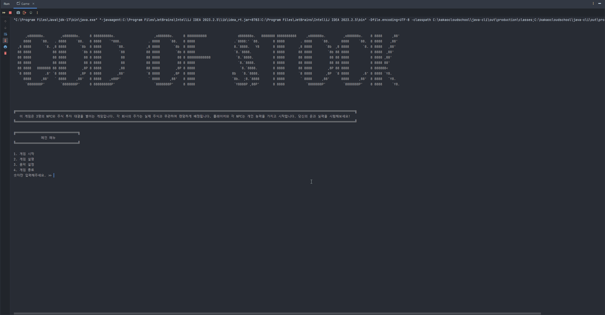
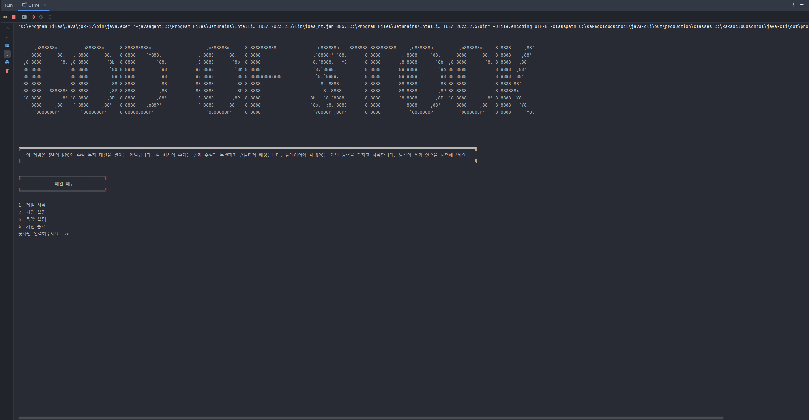
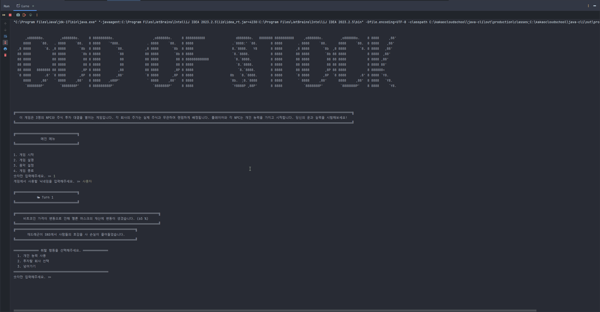
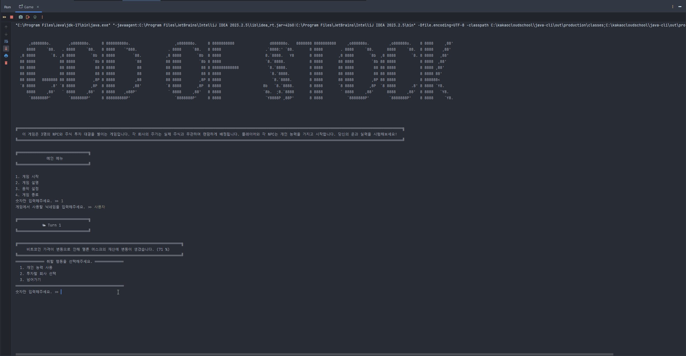
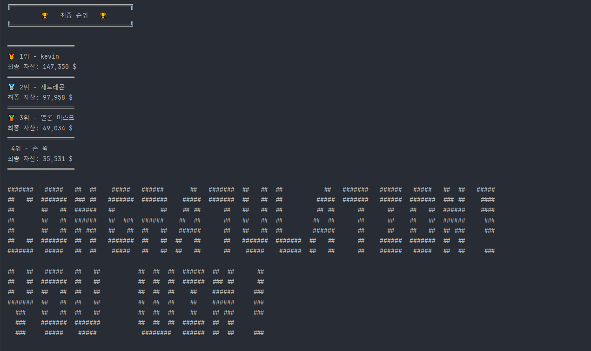
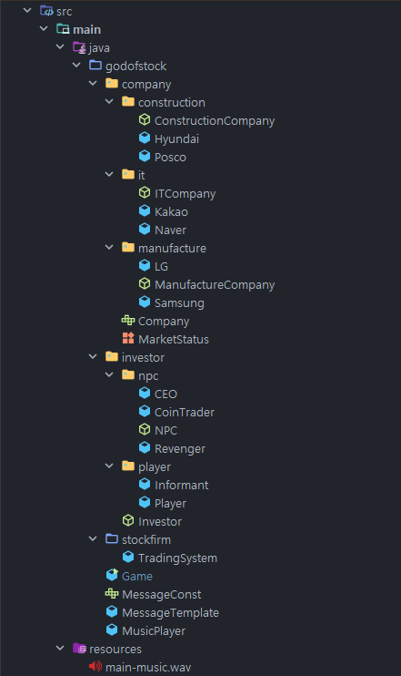
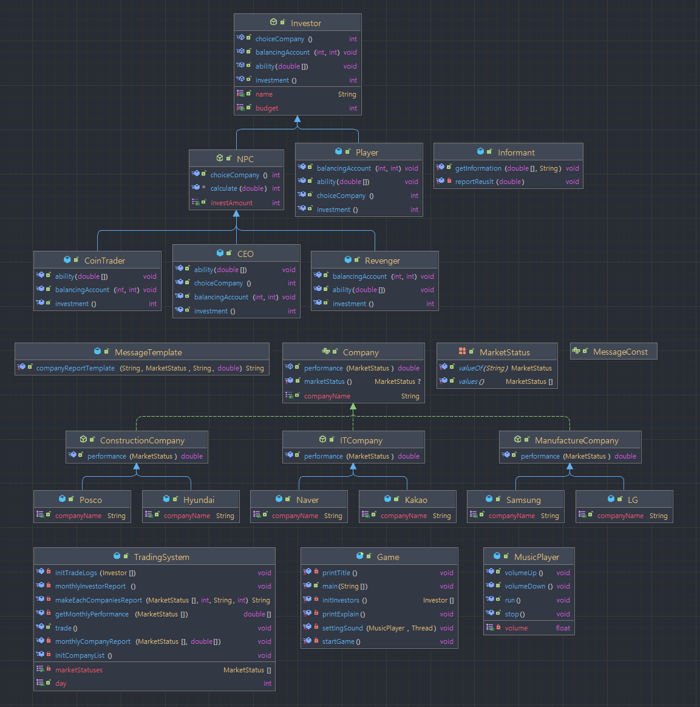

# 주식 투자 게임 - 주식의 신(God Of Stock)

 

## 기획 의도
- 주식 투자를 주제로 CLI 게임을 기획하였습니다.
- 사용자와 3명의 NPC가 게임을 진행하게 됩니다.
- 게임의 목표는 7턴 안에 가장 많은 수익을 올리는 것입니다.
- 7턴 동안의 투자 게임이 끝나면 보유 중인 자본금을 바탕으로 순위를 산정합니다.
- 사용자와 NPC들은 각자 고유한 능력을 가지고 있습니다.
    - 사용자의 능력은 보유금 한도 내에서 자유롭게 이용할 수 있습니다.
    - NPC의 능력은 매 턴 한 번씩 발동합니다. (단, 조건부 능력의 경우, 발동하지 않을 수도 있습니다)
- 각 회사는 속한 업계가 있으며, 각 업계와 회사는 매 턴 랜덤한 수치를 산출합니다.
- 두 수치를 합산하여 각 회사가 해당 턴에 가지는 수익률을 산정합니다.

 

## 고유 능력 설명

### 사용자 - 고유 능력: 정보상
사용자는 투자를 진행하기 전, 정보상에게 시장 현황에 대한 정보를 구매할 수 있습니다.  
정보상에게는 한 회사에 대한 정보만 구매 가능하며, 구매 횟수에는 제한이 없습니다.

단, 정보 구매에는 비용이 발생하며, 정보상의 등급에 따라 비용이 달라집니다.
1. 고급 정보상 - 높은 비용을 지불해야 하지만, 항상 정확한 정보만 알려줍니다. (100%)
2. 중급 정보상 - 중간 수준의 비용을 지불해야 하며, 가끔 잘못된 정보를 알려줍니다. (80%)
3. 초급 정보상 - 낮은 비용을 지불해도 되지만, 잘못된 정보를 알려줄 확률이 꽤 높습니다. (60%)

 

### 존 윅(NPC 1) - 고유 능력: 복수자
존 윅은 낮은 확률(10%)로 한 회사를 지정하여 주가를 크게 낮추는 복수(-80%)를 수행합니다.  
존 윅이 회사를 선정하는 기준은 자신에게 가장 큰 손해를 입힌 회사입니다.

 

### 멜론 머스크(NPC 2) - 고유 능력: 코인 투자
멜론 머스크는 매 턴 자신의 자본금을 가지고 코인 투자를 진행합니다.  
때문에 멜론 머스크의 자본금은 매 턴 변경됩니다. (자본금의 30% ~ 200%)

 

### 재드래곤(NPC 3) - 고유 능력: CEO
재드래곤은 삼성의 CEO로서 삼성에만 투자를 진행합니다. 그리고 초기 자본금이 1.5배 많습니다.  
또한 만약 삼성이 손해를 입을 경우, 민심을 달래 손해를 절반으로 줄입니다. (75%)

 

## 게임 시연
### 게임 설명

### 음악 설정

### 능력 사용

### 투자 진행

### 게임 승리 시

## 패키지 구조

## 클래스 다이어그램

## 클래스 설명

### company 패키지
- `<interface>` Company
  - 모든 회사 클래스의 최상위 인터페이스
  - 여러 회사 인스턴스를 하나의 배열로 다루면서 각 클래스가 자신만의 메서드를 갖게 하기 위함
  
- `<abstract class>` ConstructionCompany, ITCompany, ManufactureCompany
  - 회사가 속한 업계를 구분하는 추상 클래스
  - 업계마다 시장 동향을 따로 부여하여 수익률에 반영하기 위함

- `<class>` Hyundai, Posco, Kakao, Naver, LG, Samsung
  - 각 회사를 나타내는 클래스
  - 매 턴 마다 랜덤한 수익률을 계산

- `<enum>` MarketStatus
  - 시장 동향을 표현하기 위한 열거형

 

### investor 패키지
- `<interface>` Investor
  - 모든 투자자 클래스의 최상위 추상 클래스
  - 여러 투자자 인스턴스를 하나의 배열로 다루기 위함

- `<abstract class>` NPC
  - NPC 투자자들의 인스턴스를 묶기 위한 추상 클래스
  - NPC 인스턴스의 공통 로직을 처리하기 위함

- `<class>` CEO, CoinTrader, Revenger
  - 각 NPC를 나타내는 클래스
  - 매 턴마다 투자할 회사와 금액을 자동으로 선택하며, 각자 고유 능력을 발동할지 여부를 결정함

- `<class>` Player
  - 사용자 클래스
  - 사용자의 입력을 처리하는 로직을 가지고 있음

- `<class>` Informant
  - 사용자의 고유 능력을 처리하기 위한 클래스

 

### 기타 클래스
- `<class>` TradingSystem
  - Game 클래스와 상호작용 하여 실질적으로 게임을 실행시키는 주체인 클래스
  - Investor 클래스와 Company 클래스가 상호작용 할 수 있도록 중간에서 조율하는 역할을 담당함

- `<class>` Game
  - 게임의 흐름을 관리하는 클래스
  - main() 메서드를 가지고 있는 게임의 시작점

- `<class>` MessageConst
  - 자주 사용할 것 같은 경고문 상수들을 모아둔 인터페이스

- `<class>` MessageTemplate
  - 회사와 시장의 현황에 따라 각각 다른 문구를 출력하는 메서드를 가진 클래스

- `<class>` MusicPlayer
  - Game 클래스와 상호작용 하여 배경 음악과 관련된 기능을 통제하는 클래스